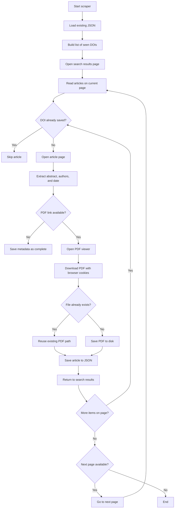

# AgriRxiv Ultimate Scraper & Research Dashboard

This project scrapes article metadata and PDFs from the CABI Digital Library AgriRxiv series, stores the results in JSON, and keeps the process resumable across runs. It also includes a local dashboard for reviewing the collected data.

---

## What This Scraper Does

The scraper collects the following for each article it finds:

- Title and article link
- DOI(Digital Object Identifier)
- Abstract
- Author names
- Online publish date
- PDF URL, if available
- Local PDF path, if downloaded successfully
- Status value that shows whether the record is complete or incomplete

It also avoids re-downloading files that already exist in the download folder and avoids re-processing articles that were already saved in the JSON file.

---

## Main Workflow



---

## Resume Download Support

The scraper is designed to continue from where it stopped.

When you start `scraper_final.py`, it first checks whether `agrirxiv_final_data.json` already exists. If it does, the scraper loads every saved record and creates an in-memory set of DOIs called `seen_dois`.

That means:

- Articles already saved in the JSON file are skipped immediately.
- The scraper can be stopped and started again without re-processing the same records.
- New articles found later are appended to the same JSON file.

This is the main resume mechanism. The JSON file is the source of truth for what has already been processed.

---

## How Existing Articles Are Checked

The scraper checks each article on the search results page using its DOI.

### Step by step

1. It loads the current list of saved records from `agrirxiv_final_data.json`.
2. It extracts the DOI from every saved record and stores those DOIs in `seen_dois`.
3. On each search-results page, it collects the articles currently visible.
4. For each article, it compares the article DOI against `seen_dois`.
5. If the DOI already exists, the article is skipped.
6. If the DOI is new, the scraper opens the article page, extracts details, downloads the PDF if available, and writes the result back to the JSON file.

This prevents duplicate entries even if the scraper is restarted many times.

### PDF file existence check

The download step also checks the target PDF file name before saving it.

- If the PDF file already exists in `downloaded_files/`, the scraper does not download it again.
- If the file does not exist, the scraper downloads it and saves it using a DOI-based sanitized file name.

So there are two protection layers:

- JSON/DOI checking for article-level resume support
- File-existence checking for PDF-level reuse

---

## Important Backup Note Before Restarting

Before starting the scraper again, take a backup of the downloaded PDF files and the JSON file.

Recommended backup items:

- `downloaded_files/`
- `agrirxiv_final_data.json`

This protects your current progress if you want to rerun the scraper with different settings, test changes, or recover from a bad run.

---

## Setup

### Requirements

- Python 3.10 or higher
- Google Chrome installed locally

### Install Dependencies

```bash
python -m venv venv
venv\Scripts\activate
pip install -r requirements.txt
```

### Chrome Driver Setup

```bash
sbase install chromedriver
```

---

## Run the Scraper

1. Confirm the download directory in `scraper_final.py` points to:

   `C:\Users\Saurabh-CSIO\Desktop\Scrapy\downloaded_files`

2. Run the scraper:

   ```bash
   python scraper_final.py
   ```

3. Watch the terminal logs for `STEP:` messages. Those logs show pagination, article skipping, metadata extraction, and download status.

---

## View the Dashboard

After scraping, you can inspect the data in the dashboard:

1. Start a local server from the project folder:

   ```bash
   python -m http.server
   ```

2. Open the dashboard in your browser:

   `http://localhost:8000/scraper_dashboard.html`

---

## Project Files

| File or Folder | Purpose |
|---|---|
| `scraper_final.py` | Main scraper logic, resume handling, and PDF download flow |
| `scraper_dashboard.html` | Local dashboard for browsing the scraped data |
| `agrirxiv_final_data.json` | Saved article database used for resume support |
| `downloaded_files/` | Local PDF storage folder |
| `scraper_debug.log` | Detailed runtime log file |
| `requirements.txt` | Python dependencies |
| `README.md` | Project documentation |

---

## Data Fields

| Field | Meaning |
|---|---|
| `title` | Article title |
| `link` | Article detail page |
| `doi` | Unique identifier used for resume checks |
| `abstract` | Article abstract text |
| `authors` | Extracted author names |
| `publish_date` | Online publication date |
| `is_pdf_available` | Whether the scraper found a PDF viewer link |
| `pdf_url` | Final PDF download URL, if available |
| `pdf_local_path` | Local PDF path on disk |
| `status` | `complete` or `incomplete` |
| `scraped_at` | Timestamp when the record was saved |

---

## Logging

The scraper writes detailed information to `scraper_debug.log`, including:

- Resume loading
- Article skipping decisions
- PDF file reuse decisions
- PDF download success or failure
- Pagination progress
- Fatal errors

---

## Configuration Notes

- Change `DOWNLOAD_DIR` in `scraper_final.py` to store PDFs in a different location.
- Adjust `crawl_delay` if you need the scraper to move faster or slower.
- Keep the JSON file intact if you want resume support to work on the next run.

---

## Troubleshooting

- If the scraper seems to repeat old records, check that `agrirxiv_final_data.json` still exists and contains the earlier run data.
- If PDFs are not downloading, confirm that the browser session can still access the PDF viewer page and that `downloaded_files/` is writable.
- If you want a clean rerun, back up the current JSON file and PDF folder first, then remove or replace the active copies.

---

## License

This project is provided as-is for research and educational purposes.