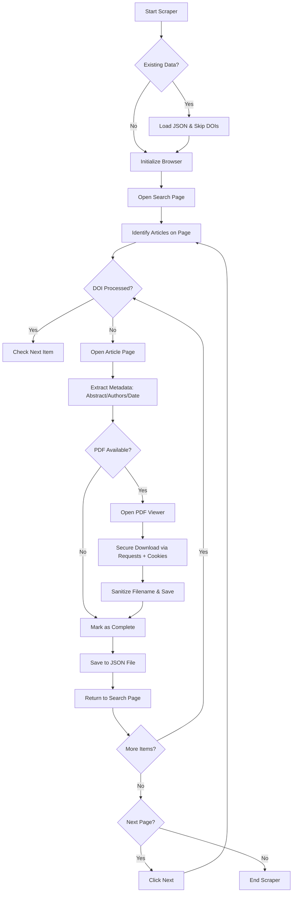

# AgriRxiv Ultimate Scraper & Research Dashboard

A high-precision, automated research data extraction suite for the **CABI Digital Library (AgriRxiv series)**. This project is engineered to bypass Cloudflare security, handle Windows file system restrictions (Errno 22), and provide a professional visual reporting interface.

---

## 📊 Process Workflow



---

## 🛠️ Setup & Installation

### 1. Prerequisites

- **Python**: 3.10 or higher
- **Google Chrome**: Must be installed on the local machine

### 2. Environment Setup

#### Activate Virtual Environment:

```bash
python -m venv venv
venv\Scripts\activate
```

#### Install Dependencies:

```bash
pip install -r requirements.txt
```

#### Initialize Driver:

```bash
sbase install chromedriver
```

---

## 🚀 Execution Guide

### Part 1: Running the Scraper

1. Verify the `DOWNLOAD_DIR` in `scraper_final.py` is set to:
   ```
   C:\Users\Saurabh-CSIO\Desktop\Scrapy\downloaded_files
   ```

2. Run the script:
   ```bash
   python scraper_final.py
   ```

3. Monitor `STEP:` logs in the terminal for real-time progress.

### Part 2: Viewing the Dashboard

Once data has been scraped, you can view the visual report:

1. Start the local server:
   ```bash
   python -m http.server
   ```

2. Open the dashboard:
   Navigate to `http://localhost:8000/scraper_dashboard.html` in your browser.

---

## 📁 Project Structure

| File/Directory | Description |
|---|---|
| `scraper_final.py` | The main execution engine featuring Cloudflare bypass and PDF cookie-sync |
| `scraper_dashboard.html` | Interactive dashboard with real-time search, filters, and abstract accordions |
| `agrirxiv_final_data.json` | The central data store (Auto-updated/Resume-enabled) |
| `downloaded_files/` | Organized directory containing sanitized PDF research papers |
| `downloaded_pdfs/` | Alternative storage directory for PDF files |
| `scraper_debug.log` | Detailed audit trail for every scraping step |
| `requirements.txt` | Python package dependencies |
| `README.md` | Project documentation |

---

## 📊 Data Features

| Field | Description |
|---|---|
| **Status** | `complete` if metadata and PDF are secured; `incomplete` if a step failed |
| **Authors** | Extracted via a three-tier selector strategy (Links, Spans, and Schema metadata) |
| **Sanitization** | File paths are automatically cleaned of restricted Windows characters (`?`, `=`, `:`) to prevent Errno 22 |
| **Resume Logic** | Skips previously processed DOIs based on the existing JSON file |

---

## ⚠️ Known Fixes Incorporated

| Issue | Solution |
|---|---|
| **Errno 22 (Invalid Argument)** | Resolved by aggressive filename sanitization |
| **403 Forbidden** | Bypassed by injecting browser cookies and User-Agents into the download request |
| **Author Extraction** | Fixed by targeting nested `givenName` and `familyName` spans found in CABI's HTML |
| **Browser Crashes** | Handled via `NoSuchWindowException` recovery and automatic JSON state management |

---

## 🔧 Configuration

- Modify the `DOWNLOAD_DIR` variable in `scraper_final.py` to change the download location
- Adjust timeout values and page navigation delays as needed for your network conditions
- Update User-Agent strings in the requests if required

---

## 📝 Logging

The scraper automatically generates `scraper_debug.log` with detailed information about:
- Each scraping step
- Errors and exceptions
- DOI processing status
- File download operations

---

## 🤝 Contributing

Contributions are welcome! Please ensure:
- Code follows PEP 8 standards
- Changes are tested before submission
- Commit messages are descriptive

---

## 📄 License

This project is provided as-is for research and educational purposes.

---

## 📞 Support

For issues or questions, refer to the project documentation or check the debug logs for troubleshooting information.